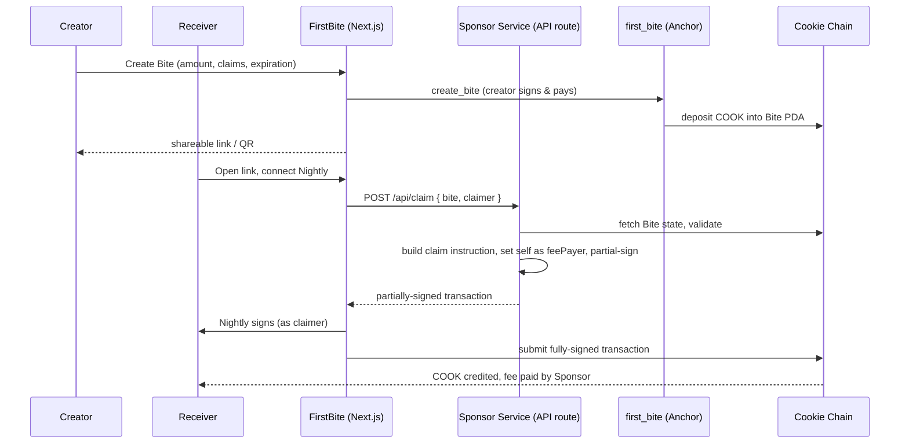

# FirstBite 🍪

> Your first bite of Cookie Chain.

Give someone their first 🍪 — a link or QR code that turns a zero-balance wallet into an active [Cookie Chain](https://www.cookiechain.wtf/) wallet, with no bridge required first.

## Problem

Cookie Chain has **no public faucet** (confirmed by direct RPC call — `requestAirdrop` returns `Invalid request` — and by multiple third-party bounty submissions reporting the same thing). A brand-new wallet cannot pay for its own first transaction, so it cannot even attempt to use a Cookie Chain app until it somehow acquires COOK first — today, that means bridging from Solana or asking the Cookie Chain team directly. That friction is the entire reason FirstBite exists.

## Solution

1. A Cookie Chain user who holds COOK creates a **Bite**: they deposit COOK into an on-chain vault and get back a shareable link/QR code.
2. They send that link to someone who has never touched Cookie Chain.
3. That person opens the link, connects Nightly, and clicks **Claim**.
4. The claim's network fee is paid by a **Sponsor Service**, not the claimer — so a wallet that starts at genuinely `0 COOK` ends the interaction as an active, funded Cookie Chain wallet.

## Demo

- Live application: https://first-bite-seven.vercel.app/ (frontend deployed; the on-chain program itself is still pending a mainnet deploy — see `docs/IMPLEMENTATION_PLAN.md` Milestone 7 — so the create/claim flow won't work end-to-end against this URL yet)
- Screenshots and a walkthrough of the create → claim flow are in `poc/RESULTS.md` and referenced throughout `docs/`.

## How It Works

```
Creator (has COOK)
  → Create Bite → deposits COOK into a program-owned PDA → gets a link/QR
Receiver (0 COOK)
  → Opens link → connects Nightly → clicks Claim
  → Sponsor Service builds & partially signs the claim transaction (pays the fee)
  → Nightly signs the rest → transaction submitted
  → Receiver now holds COOK and is an active Cookie Chain wallet
```

This isn't a generic faucet: the design specifically combines three things that, per our competitive research (`docs/research/COMPETITORS.md`), no other Cookie Chain bounty submission combines in one flow — a **pull-based** claim (the recipient reivindica, not a push airdrop), a genuinely **zero-balance** starting point, and an **automatically sponsored** fee.

## Architecture



Full design rationale and alternatives considered: `docs/ARCHITECTURE.md` and `docs/DECISIONS.md`.

## Cookie Chain

Cookie Chain is an independent SVM (Solana Virtual Machine) network — not Solana itself, with its own validator set and genesis hash (confirmed directly via RPC: `9wDaBRDgArEUpvhHxGguNkwozsZh4UpGZB9o2EoEcBB2`). COOK is its native gas token (analogous to SOL — no SPL mint, no ATAs). Measured directly against `rpc.cookiescan.io`: `solana-core 4.1.2`, ~0.455s average block time, and rent-exemption parameters identical to standard Solana/Agave. Full research: `docs/research/ECOSYSTEM.md`.

## Nightly

Nightly is the wallet FirstBite targets (per the official Cookie Chain apps registry, "the first COOK supported wallet"). Integration uses `@solana/wallet-adapter-nightly` (the actively-maintained package in the official `anza-xyz/wallet-adapter` monorepo — a different, now-deprecated Nightly-specific package was originally considered and swapped out, see `docs/DECISIONS.md`). Because Nightly doesn't publish Cookie Chain through the Wallet Standard, `app/src/app/nightly-network.tsx` proactively calls `window.nightly.solana.changeNetwork(...)` so the extension doesn't show a spurious "wrong network" warning.

## Sponsored Transactions

**Confirmed working with the real Nightly browser extension** (not just simulated): a wallet holding a genuinely zero balance connected, clicked Claim, and received its full Bite amount having paid no fee at all — verified on-chain via `solana confirm -v`, which shows the Sponsor Service's wallet as the transaction's fee payer. Full evidence trail: `docs/research/SPONSORSHIP.md` (Research Gate #1).

The Sponsor Service (`app/src/app/api/claim/route.ts`) never signs a transaction handed to it by the client. It receives only `{ bite, claimer }`, reads the Bite's on-chain state itself, builds the `claim` instruction from that validated state, sets itself as `feePayer`, and partially signs — the client completes the signature and submits. Its key lives only in `SPONSOR_SECRET_KEY` (server-only, never sent to the browser).

## Smart Contract / Program

Anchor program at `programs/first_bite/`, three instructions:

- `create_bite(bite_id, amount_per_claim, max_claims, expiration)` — deposits `amount_per_claim * max_claims` into a per-creator PDA. Rejects `amount_per_claim` below the cluster's rent-exempt minimum for a new account.
- `claim()` — a `ClaimRecord` PDA per `(bite, claimer)` makes duplicate claims impossible by construction (not just checked): the second attempt's `init` fails outright. Validates the Bite is active and not expired.
- `cancel_bite()` — creator-only; returns all remaining lamports (undistributed deposit + rent) in one transfer via account closing.

Design rationale (why a single PDA holds both state and funds, why `ClaimRecord` rather than an in-account list, etc.): `docs/ARCHITECTURE.md`.

## Security Model

Full threat model — assets, actors, trust boundaries, threats T1–T15, mitigations, and explicitly accepted residual risks — in `docs/SECURITY.md`. Reviewed twice: once via the `solana-vulnerability-scanner` skill against the on-chain program (no findings across its 6 platform-level vulnerability patterns), and once via an independent review agent with no prior context on this codebase, covering both the program and the Sponsor Service.

## Development

Prerequisites: Rust 1.89+, Solana CLI 2.3.0, Anchor CLI 0.32.1, Node.js 22+.

```bash
# Program
anchor build
anchor test              # spins up its own local validator

# Frontend (in app/)
cd app
npm install
npm run dev
```

Note: `programs/first_bite/Cargo.toml` pins `[package.metadata.solana] tools-version = "v1.54"` — the Solana CLI's default platform-tools (v1.48, rustc 1.84) can't build this Anchor version's dependency tree, which needs Rust 2024 (rustc ≥ 1.85).

## Environment Variables

See `app/.env.example`:

- `NEXT_PUBLIC_COOKIE_CHAIN_RPC` — defaults to `https://rpc.cookiescan.io`.
- `SPONSOR_SECRET_KEY` — server-only, a JSON array of secret key bytes for the wallet that pays claim fees. **Never commit a real value.**

## Testing

`anchor test` — 11 integration tests covering: valid/invalid Bite creation, a real zero-balance-claimer sponsored claim, duplicate-claim rejection, depleted/expired/cancelled Bite rejection, cancellation authorization, and arithmetic overflow protection. Run against a local `solana-test-validator`, which was confirmed to share the same rent-exemption and platform-tools behavior as the real Cookie Chain (`poc/RESULTS.md`).

## Deployment

_Pending — see `docs/IMPLEMENTATION_PLAN.md` Milestone 7._

## Program Address

_Pending mainnet deployment._

## Live Application

_Pending deployment._

## CookieScan

Once deployed, the program and its transactions will be viewable at [cookiescan.io](https://cookiescan.io).

## Roadmap

Beyond the hackathon MVP (see `docs/PRODUCT.md` for the full MoSCoW breakdown):

- **Community Bite** — one Bite, many claimers (e.g. 50 COOK / 100 claims).
- **Chain Bite** — part of a claimed amount automatically becomes a new Bite the receiver can pass on, forming an onboarding chain.
- **FirstBite SDK** (`createBite()`, `claimBite()`, `getBite()`) so any Cookie Chain cApp can embed onboarding directly.
- Campaign tooling for builders running their own onboarding drives.

## Hackathon

Built for [Create an App on Cookie Chain](https://superteam.fun/earn/listing/create-an-app-on-cookie-chain-app) (Superteam Earn, sponsored by Cookie Chain). Repository: [github.com/Astreus-J/FirstBite](https://github.com/Astreus-J/FirstBite). Research, architecture decisions, competitive analysis, and the full milestone-by-milestone build log live in `docs/`.

## License

MIT
